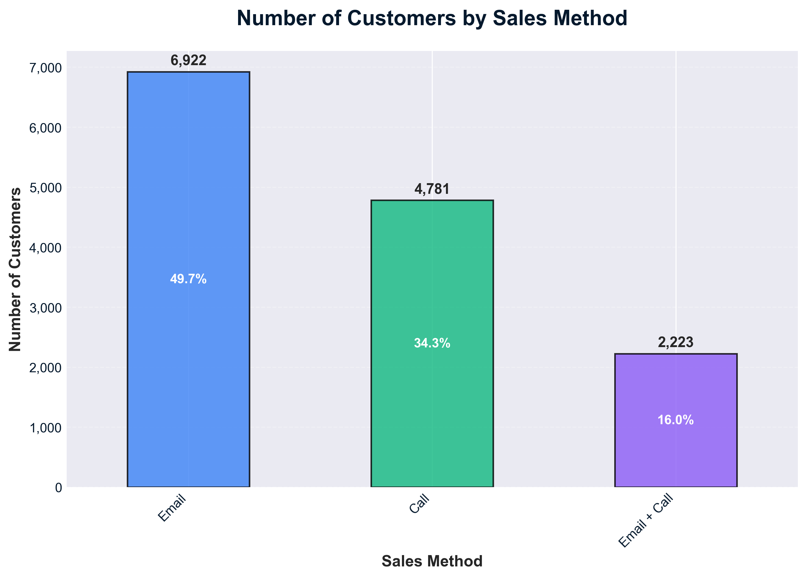
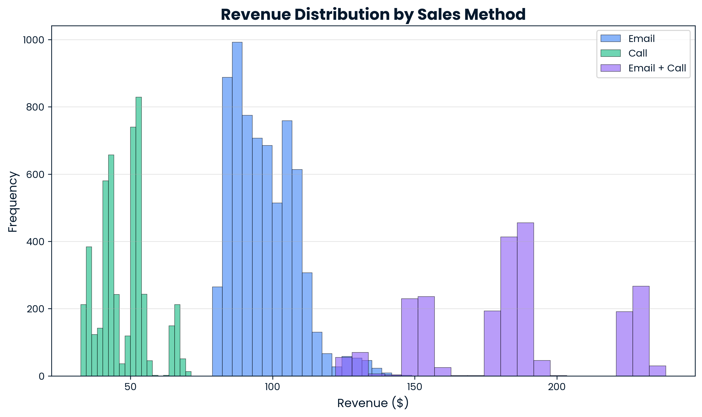
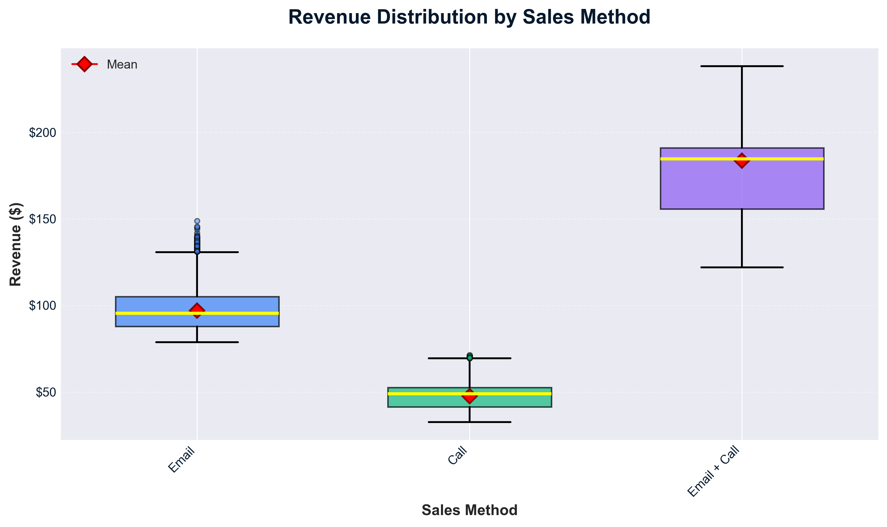
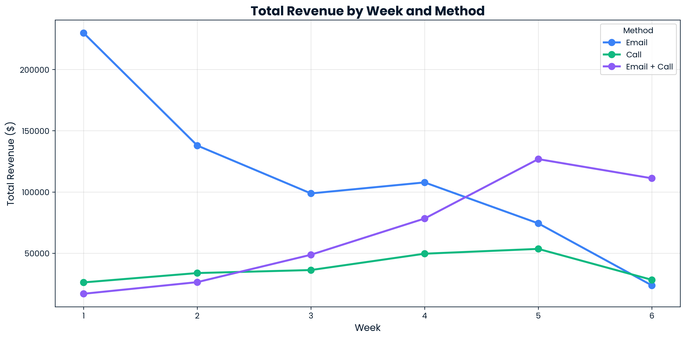
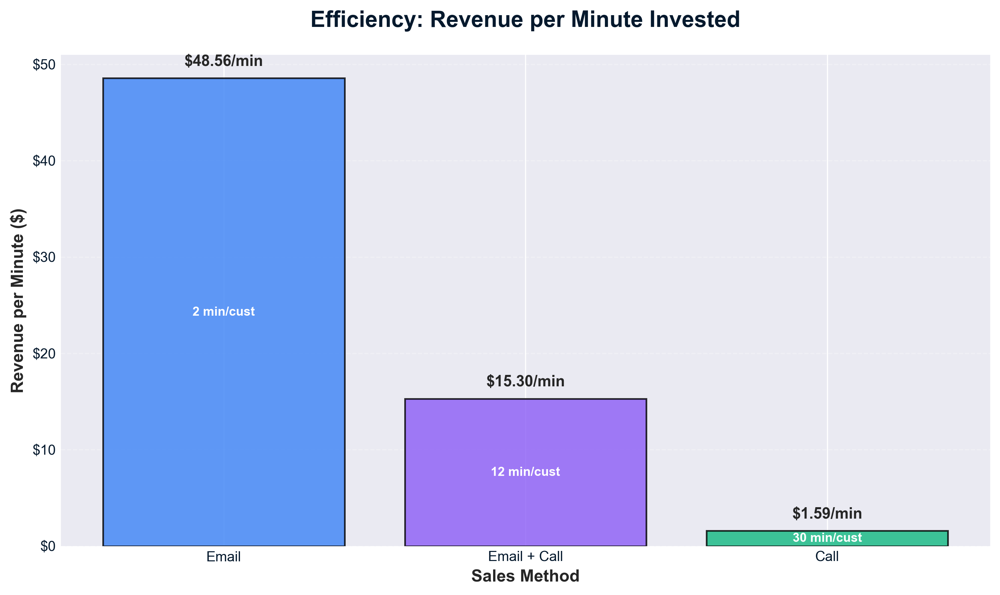
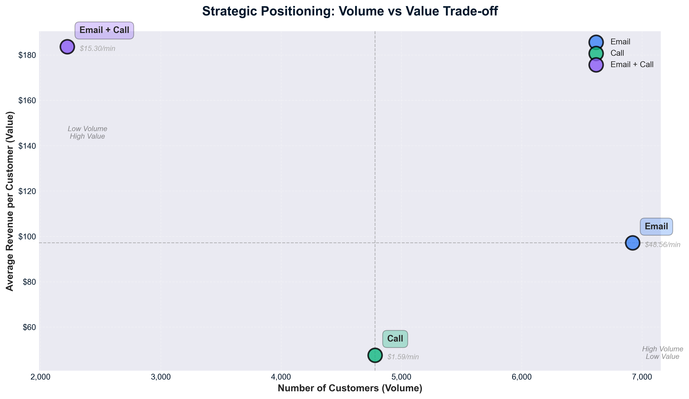

# 📊 Sales Strategy Experiment Analysis

## Executive Summary

This project analyzes a 6-week sales experiment conducted by **Pens and Printers** to determine the most effective strategy for launching a new office stationery product line. Three approaches were tested: Email, Call, and Email + Call, involving 13,926 customers across 50 US states.

**Critical Finding:** Email + Call generates **$183.65 revenue per customer** (286% more than Call) while requiring **60% less time investment**. This method demonstrated consistent growth (+558% over 6 weeks) while Email declined by 89.7%, indicating unsustainability for new customer acquisition.

**Financial Impact:** Eliminating the Call method and optimizing resource allocation could increase revenue per minute from $7.11 to $23.07 (224% improvement), representing approximately **$470,000 in annual opportunity cost savings**.

**Recommendation:** Scale Email + Call to 80-90% of sales effort for new customer acquisition, reserve Email for existing customer engagement (10-15%), and completely eliminate the Call-only approach.

---

## 📑 Table of Contents

1. [Business Context](#-business-context)
2. [Data Validation](#-data-validation)
3. [Key Findings](#-key-findings)
   - [1. Customer Distribution by Sales Method](#1-customer-distribution-by-sales-method)
   - [2. Revenue Distribution Analysis](#2-revenue-distribution-analysis)
   - [3. Revenue Trends Over Time](#3-revenue-trends-over-time)
   - [4. Efficiency Analysis: Revenue per Minute](#4-efficiency-analysis-revenue-per-minute)
   - [5. Strategic Positioning](#5-strategic-positioning-volume-vs-value)
4. [Business Metrics & Monitoring](#-business-metrics--monitoring)
5. [Strategic Recommendations](#-strategic-recommendations)
6. [Technical Implementation](#-technical-implementation)
7. [Project Structure](#-project-structure)

---

## 🏢 Business Context

### About Pens and Printers

Pens and Printers, founded in 1984, is a trusted provider of high-quality office products to large organizations. As consumer buying patterns evolve, the company needed to identify the most effective sales approach for launching new product lines.

### The Challenge

Six weeks ago, the company launched a new line of office stationery focused on creative brainstorming tools (notebooks, pens, sticky notes). Despite increasing digitalization, demand for these products remains strong. The executive team needed data-driven insights to determine which sales method delivers the best results.

### Sales Methods Tested

| Method | Description | Time Investment |
|--------|-------------|----------------|
| **Email** | Two emails (launch + 3-week follow-up) | ~2 minutes per customer |
| **Call** | Direct phone outreach | ~30 minutes per customer |
| **Email + Call** | Email first, then 10-min call a week later | ~12 minutes per customer |

### Business Questions

1. How many customers were reached by each approach?
2. What does the revenue distribution look like overall and by method?
3. Was there any difference in revenue over time for each method?
4. Which method should we continue using, considering time investment?
5. Are there differences between customer groups that explain performance?

---

## 🔍 Data Validation

The dataset contains **13,926 rows and 8 columns** representing individual customer transactions over a 6-week period.

**[📓 View Data Cleaning Code](notebooks/01_data_cleaning.py)**

### Column Validation Summary

| Column | Data Type | Unique Values | Cleaning Actions |
|--------|-----------|---------------|------------------|
| `week` | Numeric | 6 | ✅ No cleaning needed |
| `sales_method` | Categorical | 3 | ✅ Standardized (em + call → Email + Call) |
| `customer_id` | String | 13,926 | ✅ No duplicates found |
| `nb_sold` | Numeric | 10 | ✅ No anomalies |
| `revenue` | Numeric | 6,743 | ✅ Missing values corrected |
| `years_as_customer` | Numeric | 42 | ✅ Validated range |
| `nb_site_visits` | Numeric | 26 | ✅ No inconsistencies |
| `state` | Categorical | 50 | ✅ All US states present |

**Final Dataset:** 13,926 rows × 8 columns with complete, validated data ready for analysis.

---

## 📈 Key Findings

### 1. Customer Distribution by Sales Method

**[📓 View Analysis Code](notebooks/02_sales_method_comparison.py)**

From the 6-week experiment, customer allocation was:
- **Email:** 6,922 customers (50%)
- **Call:** 4,781 customers (34%)
- **Email + Call:** 2,223 customers (16%)



**Analysis:**

The distribution reveals our initial resource allocation strategy: 50% to Email (scalability bet), 34% to Call (high-touch investment), and only 16% to Email + Call (most complex method). The critical question became: did this resource allocation align with actual performance outcomes?

---

### 2. Revenue Distribution Analysis

**[📓 View Analysis Code](notebooks/03_revenue_distribution.py)**

When separated by sales method, three completely distinct revenue patterns emerge:





**Analysis:**

The data reveals three fundamentally different customer behaviors:

| Method | Median Revenue | Revenue Range (IQR) | Pattern |
|--------|---------------|---------------------|---------|
| **Call** | $47 | $41 - $53 | Clustered at 40-50 USD (resistance) |
| **Email** | $97 | $88 - $105 | Centered at 90-100 USD (standard purchase) |
| **Email + Call** | $184 | $156 - $191 | Dominates 150-220+ USD (premium purchase) |

**Critical Insight:** Email + Call's minimum revenue ($122) exceeds Email's maximum revenue ($149). These aren't variations of the same approach—each method activates fundamentally different buying behaviors.

**Interpretation:**
- **Call** generates resistance and minimal purchases
- **Email** generates interest and standard purchases  
- **Email + Call** generates trust and premium purchases

---

### 3. Revenue Trends Over Time

**[📓 View Analysis Code](notebooks/04_temporal_trends.py)**

The temporal analysis reveals a dramatic reversal in method effectiveness over the 6-week period:



**Week 1 vs Week 6 Performance:**

| Method | Week 1 Revenue | Week 6 Revenue | Change |
|--------|---------------|----------------|--------|
| **Email** | $229,766 (84%) | $23,707 (16%) | **-89.7%** ⬇️ |
| **Email + Call** | $16,885 (6%) | $111,152 (77%) | **+558%** ⬆️ |
| **Call** | $27,538 (10%) | $10,453 (7%) | -62% ⬇️ |

**Analysis:**

**Email + Call** shows consistent growth trajectory, improving from $129 per customer (Week 1) to $228 per customer (Week 6)—a **76.7% increase**. This upward trend indicates the method becomes more effective as the team gains experience and customers respond positively to warm calling.

**Email** exhibits classic "pipeline exhaustion." It peaked in Week 1 with early adopters, then declined sharply as this high-intent segment depleted. By Week 6, Email revenue had collapsed by 89.7%, demonstrating it excels at capturing immediate opportunities but is unsustainable for ongoing new customer acquisition.

**Call** remained consistently poor throughout all 6 weeks, never demonstrating improvement or learning curve benefits.

**The Crossover Point:** In Week 5, Email + Call surpassed Email for the first time ($126,810 vs $74,373), marking the inflection point where sustainable methodology overtook the exhausting approach.

---

### 4. Efficiency Analysis: Revenue per Minute

**[📓 View Analysis Code](notebooks/05_efficiency_analysis.py)**

When we calculate revenue per minute of sales team time, the efficiency differences become dramatic:



**Efficiency Comparison:**

| Method | Time per Customer | Avg Revenue | Revenue per Minute | Efficiency Rating |
|--------|------------------|-------------|-------------------|-------------------|
| **Email** | 2 min | $97.11 | **$48.56/min** | ⭐⭐⭐⭐⭐ Highest |
| **Email + Call** | 12 min | $183.65 | **$15.30/min** | ⭐⭐⭐⭐ Excellent |
| **Call** | 30 min | $47.60 | **$1.59/min** | ⭐ Catastrophic |

**The Paradox:**

Call invests **30 minutes** to generate **$47.60**. Email + Call invests only **12 minutes** (60% less time) to generate **$183.65** (286% more revenue).

**Why Email + Call Dominates:**

The email "pre-warms" the customer, transforming them from cold prospect to informed, receptive buyer. A 10-minute conversation with a warm lead who has already reviewed product information beats 30 minutes of cold calling resistance every single time.

**Financial Impact:**

Every minute spent on Call costs us between **$13.71 - $46.97** in opportunity cost versus alternative methods. At current call volume (4,781 customers × 30 min = 143,430 minutes), this equals approximately **$470,000 in annual opportunity cost**.

---

### 5. Strategic Positioning: Volume vs Value

**[📓 View Analysis Code](notebooks/05_efficiency_analysis.py)**

The scatter plot visualizes the strategic trade-off between customer volume and revenue per customer:



**Strategic Analysis:**

| Method | Position | Volume | Value | Strategic Fit |
|--------|----------|--------|-------|---------------|
| **Email** | Mass Reach | High (7,000) | Medium ($97) | ✅ Best for existing customers |
| **Email + Call** | Premium Conversion | Low (2,200) | High ($184) | ✅ Best for new acquisition |
| **Call** | Worst Quadrant | Medium (4,800) | Low ($48) | ❌ No strategic advantage |

**Critical Insight:** Call occupies the worst possible position—neither high volume nor high value. It falls far below the "efficiency frontier" that would connect Email and Email + Call.

**Optimal Strategy:** Combine Email (for mass reach with existing customers) + Email + Call (for high-value new customer acquisition). Eliminate Call entirely as it provides no strategic advantage in any scenario.

---

## 📊 Business Metrics & Monitoring

### Primary Metric: Revenue per Minute (RPM)

**Definition:** Total Revenue Generated ÷ Total Minutes Invested

**Current Performance:**
- Blended RPM: **$7.11/minute** across all methods
- Email: $48.56/min | Call: $1.59/min | Email + Call: $15.30/min

**Target Performance:**
- Optimized method mix (90% Email + Call, 10% Email)
- Target blended RPM: **$23.07/minute**
- Represents **3.2X improvement** (224% increase)

### Monitoring Dashboard

| Metric | Current | Target | Alert Threshold |
|--------|---------|--------|-----------------|
| Blended RPM | $7.11/min | $23.07/min | < $20/min |
| Email + Call % | 16% | 90% | < 75% |
| Email % (existing customers) | 50% | 10% | > 20% |
| Call % | 34% | 0% | > 5% |

**Success Indicators:**
- ✅ Blended RPM shows consistent weekly growth toward $23.07 target
- ✅ Method mix reaches 90% Email + Call within 6 months
- ✅ Weekly revenue volatility decreases (indicating sustainable model)

**Warning Signs:**
- ⚠️ Blended RPM falls below $20/minute
- ⚠️ Email + Call revenue per customer plateaus or declines
- ⚠️ Method mix optimization stalls above 25% Email allocation

---

## 💡 Strategic Recommendations

### Immediate Actions (Week 1-4)

#### 1. Eliminate Call Methodology
- **Rationale:** Call generates only $1.59/minute with no improvement trajectory over 6 weeks
- **Impact:** Eliminates $470,000 annual opportunity cost
- **Action:** Redirect all Call resources to Email + Call training and execution
- **Timeline:** Phase out completely within 30 days

#### 2. Reposition Email for Existing Customers Only
- **Rationale:** Email revenue declined 89.7% from Week 1 to Week 6 with new prospects
- **Use Cases:**
  - Re-engagement campaigns for dormant customers
  - Upselling/cross-selling to existing relationships
  - Maintenance communication with established accounts
- **Target Allocation:** 10-15% of sales effort
- **Timeline:** Implement segmentation within 2 weeks

#### 3. Scale Email + Call as Primary Acquisition Method
- **Rationale:** Sustained growth (+558% over 6 weeks) and highest customer value ($183.65)
- **Target Allocation:** 80-90% of sales effort for new customer acquisition
- **Timeline:** Ramp up over 8-week period
- **Supporting Actions:**
  - Develop Email + Call playbooks and scripts
  - Train sales team on warm calling techniques
  - Test optimal email-to-call timing intervals (currently 1 week)

### Medium-Term Optimization (Month 2-6)

#### 4. Refine Email + Call Timing
- **Hypothesis:** The 1-week gap between email and call may not be optimal
- **Test:** A/B test 3-day, 7-day, and 14-day intervals
- **Measure:** Conversion rate, revenue per customer, customer satisfaction

#### 5. Customer Segmentation Analysis
- **Objective:** Identify characteristics of high-value Email + Call customers
- **Variables to analyze:** `years_as_customer`, `nb_site_visits`, `state`, purchase history
- **Application:** Predictive model to prioritize Email + Call outreach

#### 6. Track Leading Indicators
- **Monitor weekly:**
  - Revenue per Minute (RPM) by method and blended
  - Method mix percentages
  - Revenue per customer trends
  - Team productivity metrics (calls per day, conversion rates)

### Success Metrics (6-Month Targets)

| KPI | Current | 6-Month Target |
|-----|---------|----------------|
| Blended Revenue per Minute | $7.11 | $23.07 |
| Email + Call Allocation | 16% | 85-90% |
| Average Customer Value | $98 | $160+ |
| Total Revenue (projected) | Baseline | +224% |
| Sales Team Efficiency | Baseline | +200% |

---

## 🛠️ Technical Implementation

### Technology Stack

- **Language:** Python 3.x
- **Data Analysis:** pandas, numpy
- **Visualization:** matplotlib, seaborn
- **Statistical Analysis:** scipy (optional for advanced testing)

### Setup Instructions

1. **Clone the repository:**
   ```bash
   git clone https://github.com/Isaaccev7/sales-strategy-experiment-analysis.git
   cd sales-strategy-experiment-analysis
   ```

2. **Install dependencies:**
   ```bash
   pip install -r requirements.txt
   ```

3. **Run analysis notebooks:**
   ```bash
   # Data cleaning and validation
   python notebooks/01_data_cleaning.py
   
   # Individual analyses
   python notebooks/02_sales_method_comparison.py
   python notebooks/03_revenue_distribution.py
   python notebooks/04_temporal_trends.py
   python notebooks/05_efficiency_analysis.py
   ```

4. **View visualizations:**
   - All charts are saved in `visualizations/` directory
   - Charts are also embedded in this README

### Requirements

```
pandas>=2.0.0
matplotlib>=3.7.0
seaborn>=0.12.0
numpy>=1.24.0
```

---

## 📁 Project Structure

```
sales-strategy-experiment-analysis/
│
├── README.md                           # This file - comprehensive project documentation
│
├── data/
│   ├── raw/
│   │   └── product_sales.csv           # Original dataset (13,926 rows × 8 columns)
│   └── processed/                      # Cleaned/transformed data (if needed)
│
├── notebooks/
│   ├── 01_data_cleaning.py             # Data validation and cleaning
│   ├── 02_sales_method_comparison.py   # Customer distribution analysis
│   ├── 03_revenue_distribution.py      # Revenue pattern analysis
│   ├── 04_temporal_trends.py           # Time-series performance analysis
│   └── 05_efficiency_analysis.py       # RPM and strategic positioning analysis
│
├── visualizations/
│   ├── 1_customers_by_method.png       # Customer allocation by sales method
│   ├── 2C_revenue_by_method_boxplots.png    # Revenue distribution boxplots
│   ├── 2D_revenue_by_method_histograms.png  # Revenue distribution histograms
│   ├── 3_Total_Revenue_by_Week_and_Method.png  # Temporal trends analysis
│   ├── 4C_revenue_per_minute.png       # Efficiency comparison
│   └── 4D_customer_revenue_relationship.png # Strategic positioning scatter
│
├── .gitignore                          # Git ignore rules
└── requirements.txt                    # Python dependencies
```

---

## 📧 Contact & Feedback

**Author:** Isaac Cevallos
**Project Date:** November 2025  
**Analysis Period:** 6-week sales experiment

For questions, feedback, or collaboration opportunities, please open an issue in this repository.

---

## 📄 License

This project is available for educational and portfolio purposes.

---

*This analysis demonstrates data-driven decision making for sales strategy optimization, combining statistical analysis, business metrics, and actionable recommendations for executive stakeholders.*